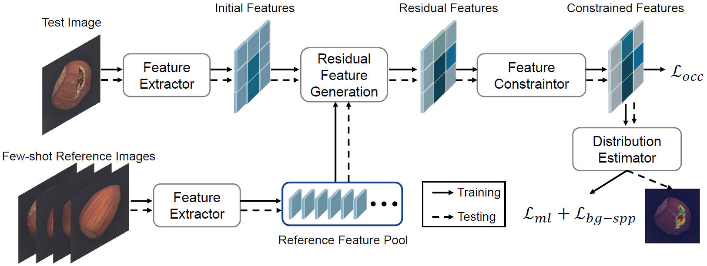
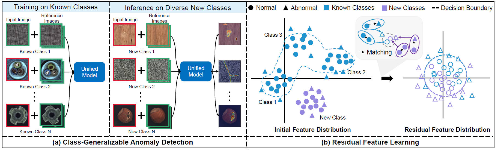

## Extending 'ResAD: A Simple Framework for Class Generalizable Anomaly Detection (NeurIPS Spotlight, 2024)' for Hauptseminar: Advanced Machine Learning for Anomaly Detection



Intuitive illustration of class-generalizable anomaly detection and conceptual illustration of residual feature learning:



---


## Download Few-Shot Reference Samples
The few-shot reference normal samples are already downloaded and can be found in `./data` directory. It is downloaded from [Data](https://huggingface.co/datasets/xcyao00/resad-data/tree/main).

## Download Datasets
Please download MVTecAD dataset from [MVTecAD dataset](https://www.mvtec.com/de/unternehmen/forschung/datasets/mvtec-ad/), VisA dataset from [VisA dataset](https://amazon-visual-anomaly.s3.us-west-2.amazonaws.com/VisA_20220922.tar), BTAD dataset from [BTAD dataset](http://avires.dimi.uniud.it/papers/btad/btad.zip), and MVTec3D dataset from [MVTec3D dataset](https://www.mvtec.com/company/research/datasets/mvtec-3d-ad), MPDD dataset from [MPDD dataset](https://github.com/stepanje/MPDD), MVTecLOCO dataset from [MVTecLOCO dataset](https://www.mvtec.com/company/research/datasets/mvtec-loco), BraTS dataset from [BraTS dataset](https://www.kaggle.com/datasets/dschettler8854/brats-2021-task1).

## Creating Reference Features
Please run the following code for extracting reference features used during testing as reference. 
```bash
# For MVTecAD
python extract_ref_features.py --dataset mvtec --few_shot_dir ./data/4shot/mvtec --save_dir ./ref_features/w50/mvtec_4shot 
# For BTAD
python extract_ref_features.py --dataset btad --few_shot_dir ./data/4shot/btad --save_dir ./ref_features/w50/btad_4shot 
# For VisA
python extract_ref_features.py --dataset visa --few_shot_dir ./data/4shot/visa --save_dir ./ref_features/w50/visa_4shot
# For MVTec3D
python extract_ref_features.py --dataset mvtec3d --few_shot_dir ./data/4shot/mvtec3d --save_dir ./ref_features/w50/mvtec3d_4shot
```


## Training and Evaluating
In this repository, we use ``wide_resnet50`` as the feature extractor by default.

- Run code for training and evaluating MVTecAD
```bash
python main.py --setting visa_to_mvtec --train_dataset_dir /path/to/your/dataset --test_dataset_dir /path/to/your/dataset  --test_ref_feature_dir ./ref_features/w50/mvtec_4shot --num_ref_shot 4 --device cuda:0
```
- Run code for training and evaluating BTAD
```bash
python main.py --setting mvtec_to_btad --train_dataset_dir /path/to/your/dataset --test_dataset_dir /path/to/your/dataset  --test_ref_feature_dir ./ref_features/w50/btad_4shot --num_ref_shot 4 --device cuda:0
```
- Run code for training and evaluating VisA
```bash
python main.py --setting mvtec_to_visa --train_dataset_dir /path/to/your/dataset --test_dataset_dir /path/to/your/dataset  --test_ref_feature_dir ./ref_features/w50/visa_4shot --num_ref_shot 4 --device cuda:0
```
- Run code for training and evaluating MVTec3D
```bash
python main.py --setting mvtec_to_mvtec3d --train_dataset_dir /path/to/your/dataset --test_dataset_dir /path/to/your/dataset  --test_ref_feature_dir ./ref_features/w50/mvtec3d_4shot --num_ref_shot 4 --device cuda:0
```


### Download ImageBind Checkpoint

For Imagebind as feature extractor, you can download the pre-trained ImageBind model from [this link](https://dl.fbaipublicfiles.com/imagebind/imagebind_huge.pth). After downloading, please put the downloaded file (imagebind_huge.pth) in `./pretrained_weights/imagebind/` directory. For creating reference features, please replace the main() function with main2() in extract_ref_features.py script, the running code is similar. For training and evaluating, please replace main.py with main_ib.py in above running command.
- Run code for training and evaluating MVTecAD
```bash
python main_ib.py --setting visa_to_mvtec --train_dataset_dir /path/to/your/dataset --test_dataset_dir /path/to/your/dataset  --test_ref_feature_dir ./ref_features/ib/mvtec_4shot --num_ref_shot 4 --device cuda:0
```

---

## Multi-Shot Evaluation with ResAD Extensions 

The extensions for this advanced seminar include **multi-shot training**, **shot sensitivity analysis**, and **class-wise failure analysis** built on top of the official ResAD framework.

---

### Multi-Shot Training & Evaluation

We extend `main.py` into a new script `main_extended_multi_shot.py` that automatically evaluates **2, 4, 6, and 8-shot** settings in a single run.

Before running this, make sure you've extracted 8-shot reference features:

```bash
python extract_ref_features.py \
  --dataset visa \
  --few_shot_dir ./data/8shot/visa \
  --save_dir ./ref_features/w50/visa_8shot
```
Run multi-shot training + evaluation:

```bash
python main_extended_multi_shot.py \
  --setting mvtec_to_visa \
  --train_dataset_dir /path/to/mvtec \
  --test_dataset_dir /path/to/visa \
  --test_ref_feature_dir ./ref_features/w50/visa_8shot \
  --checkpoint_path ./checkpoints/ \
  --epochs 60 \
  --device cuda:0
```
This will generate the following folder structure:

checkpoints/
├── mvtec_to_visa_2shot/
│   ├── mvtec_to_visa_2shot_epoch59_metrics.csv
│   ├── mvtec_to_visa_2shot_epoch59_pixel_auroc.png
│   ├── mvtec_to_visa_2shot_latest.pth
├── mvtec_to_visa_4shot/
│   └── ...
...

### Extension 1: Shot Sensitivity Analysis
This script visualizes how AUROC changes with the number of reference shots.
1. Loads metrics from the checkpoints/ folders
2. Splits MVTecAD and VisA results
3. Produces a plot: shots_vs_auroc.png
   
### Extension 2: Class-wise Failure Case Analysis
This script highlights the top-3 lowest-performing classes based on pixel-level AUROC.
1. Loads 4-shot CSV
2. Sorts classes
3. Highlight 3 worst AUROC bars in red

### Summary of Custom Extensions

| Feature                     | Script                         | Description                             |
| --------------------------- | ------------------------------ | --------------------------------------- |
| Multi-shot training/testing | `main_extended_multi_shot.py`  | Trains & evaluates 2/4/6/8-shot         |
| AUROC vs Shot Plot          | `shot_sensitivity_analysis.py` | Shows gains with more reference samples |
| Class-wise Failure Bars     | `classwise_failure.py`         | Highlights weak-performing classes      |

Feel free to fork or contribute to the extended version here: https://github.com/saranyab21/ResAD-extended

## Reference:

```
@article{ResAD,
      title={ResAD: A Simple Framework for Class Generalizable Anomaly Detection}, 
      author={Xincheng Yao and Zixin Chen and Gao Chao and Guangtao Zhai and Chongyang Zhang},
      year={2024},
      booktitle={Thirty-Eighth Annual Conference on Neural Information Processing Systems, NeurIPS 2024},
      url={https://arxiv.org/abs/2410.20047},
      primaryClass={cs.CV}
}
```


